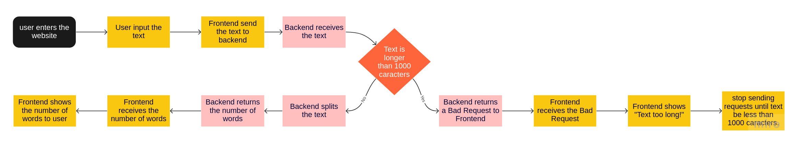

# Words Counter

[Words Counter](https://words-count-rho.vercel.app/) is a app to count how many words there are in a text.

## UX/UI


The design of the website is very simple, a title "Words Counter", a textbox to the user insert the text, and a counter below the textbox, counting how many words there are in the textbox.

To make the use more pratical, the website doesn't have any button, the user only need to type in the textbox, and the count will be updated.

## Architecture and flowchart

The website is made by a backend, that receives the text, if the text is longer than 1000 caracters, send a `Bad Request` response, saying that text is too long, if not, count, and return the number in a API, and a frontend, that gets the text from the user, send to the backend, get the number response, and show in the screen.

This flowchart can be represented in visual way, that can be more simple to understand.



> The limit of 1000 caracters is to simulate a DDoS security, preventing the server to process too many words per second.

## Running

You can run backend and frontend separately, to do it, see the instructions in the backend's and frontend's directories, but to start them together, you can use the docker-compose, with the up command, like below:

```shell
docker-compose up
```

## Improvements that can be done

- CORS security to prevent other IP's than frontend to send requests to backend;
- Container orchestration to prevent the backend or frontend to fall, upping a new instance when it happens;
- Unitary tests in the frontend;
- Swagger documentation in backend
