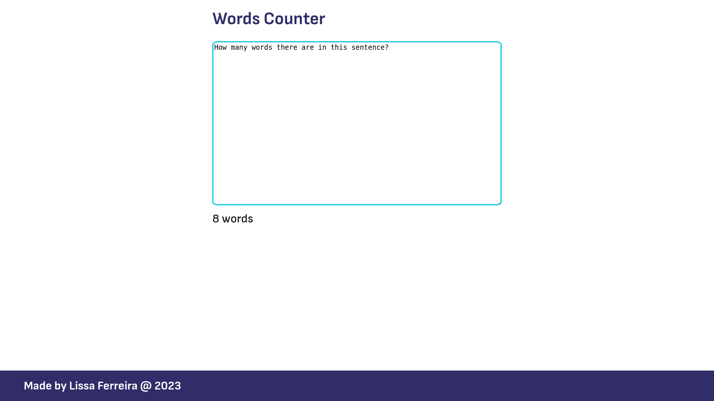

# Words Counter Frontend
**Words Counter frontend** is the frontend side of Words Counter app. The objective is show how many words there are in a text, sending a POST request to backend.

The project is made with Javascript, using VueJS framework.



# Routes

## Homepage `/`

The website have only one page, that is the homepage with the form to input the text.

# Running

## Docker

The app can be run using `lissatransborda/words-counter-frontend` image, with the command below:

```shell
docker run -i -p 8080:8080 lissatransborda/wordscounter-frontend
```

## Yarn

The app can be run with Yarn too, using the `serve` task, with the command below:

```shell
yarn serve
```

# Build
## Docker

To build the image of the project, use docker build, with the command below:

```shell
docker build -t lissatransborda/wordscounter-frontend .
```

## Yarn

To build the compiled version of the project, use `build` task, with the command below:

```shell
yarn build
```

